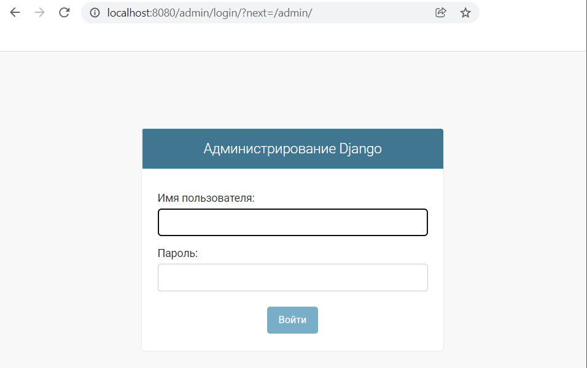

# Лабораторная работа №7

**Задание:** Выполнить все 7 частей туториала, опубликованного по ссылке: https://docs.djangoproject.com/en/3.2/.

---

## Ход работы

### **--- Часть 1 ---**

Я установила Django и запустила тестовый сервер.

Затем создала новый каталог для нового приложения "Опросы".

В этой структуре каталогов будет размещено приложение опроса.

Следующим шагом было создание новой страницы опросов. В итоге структура каталогов изменилась и я получила следующий результат:

### **--- Часть 2 ---**

Первым шагом в этой части стало изучение файла settings.py, в котором были описаны некоторые базовые фреймворки для работы приложения.

Затем мне необходимо было создать таблицы в базе данных, что я сделала с помощью следующей команды в терминале:

Далее в файле models.py были созданы модели вопросов и ответов по опросам. А затем эти модели были активированы с помощью команды в терминале.

После активации моделей через команду терминала `python manage.py migrate` я синхронизировала изменения в моделях с БД.

Следующим шагом было изучение возможностей БД через интерактивную оболочку и создание одного вопроса.

Далее я создала пользователя-администратора.

И проверила работу страницы администратора через запуск сервера.

Затем была подключена модель с вопросами, чтобы ее можно было редактировать через интерфейс админа.

После входа в группу "Polls" в подгруппу "Questions" можно увидеть все созданные ранее вопросы.

Затем я изучила возможности интерфейса для создания, редактирования и удаления вопросов для пользователя admin.

### **--- Часть 3 ---**

После изучения представлений, которые бывают в Django, я добавила три представления для опросов в свое приложение. Результаты данного действия можно видить ниже на скриншотах.

Далее я создала шаблон для отображения главной страницы и обновила ее представление в приложении в файле views.py. Таким образом, представление главной страницы изменилось:

с |  | на
--- | --- | ---
 |  | 

Следующим шагом было создание шаблона для отображения деталей вопроса и отображение страницы с ошибкой "Not Found", если вопроса не существует. Для этого был добавлен новый файл в папку templates и отредактирован файл views.py. Так как сейчас в списке вопросов есть только один вопрос, то ошибка 404 не выдается только на идентификатор под номером 1, то есть на URL `/polls/1/`. Остальные номера вопросов не существуют на данный момент и отображают ошибку 404.

Последнее, что я сделала в данной части, это изменила несколько путей URL, чтобы убрать жесткую связанность и добавить использование пространства имен своего приложения.

### **--- Часть 4 ---**

В начале данной части я изменила представление страниц с выбором ответа на вопрос и результатами. Для этого я изменила шаблон details.html и файл с отображениями views.py. После изменений страницы вопросов стали выглядеть и реагировать следующим образом:

Затем я снова изменила представления с индивидуальных на общие, для чего я:

1. преобразовала URLconf
2. удалила некоторые из старых, ненужных представлений
3. внедрила новые представления, основанные на общих представлениях Django

В итоге отображение на сайте не изменилось, однако кода стало гораздо меньше, и он стал более понятным.

### **--- Часть 5 ---**

Для начала я изучила информацию о том, как можно писать тесты в Django.

Далее по инструкции я написала в интерактивной консоли Django некоторые команды, которые создали "отложенный" вопрос. С помощью этого вопроса я смогла выявить ошибку кода, которую нужно исправить.

Далее я написала тест для этой ошибки и удостоверилась в том, что ошибка действительно есть, а потом изменила код, чтобы исправить данную и будущие ошибки.

Далее, для того чтобы проверить клиентскую часть, я написала несколько команд в интерактивную среду:

Это показало, что список опросов показывает опросы, которые еще не опубликованы, поэтому далее я исправила этот момент в файле views.py.

Следующим шагом стало добавление тестов, которые будут проверять правильность отображения главной страницы приложения, страницы опроса и страницы результатов. Поэтому в файле tests.py появился большой пласт дополнительных тестов.

Последнее, что я сделала в данной части, - это еще раз запустила сервер и проверила, что все работает корректно.

