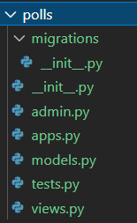
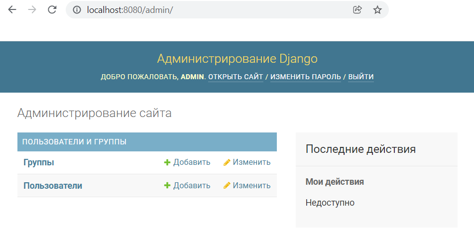

# Лабораторная работа №7

**Задание:** Выполнить все 7 частей туториала, опубликованного по ссылке: https://docs.djangoproject.com/en/3.2/.

---

## Ход работы

### **--- Часть 1 ---**

Я установила Django и запустила тестовый сервер.

Затем создала новый каталог для нового приложения "Опросы".

В этой структуре каталогов будет размещено приложение опроса.

Следующим шагом было создание новой страницы опросов. В итоге структура каталогов изменилась и я получила следующий результат:

### **--- Часть 2 ---**

Первым шагом в этой части стало изучение файла settings.py, в котором были описаны некоторые базовые фреймворки для работы приложения.

Затем мне необходимо было создать таблицы в базе данных, что я сделала с помощью следующей команды в терминале:

Далее в файле models.py были созданы модели вопросов и ответов по опросам. А затем эти модели были активированы с помощью команды в терминале.

После активации моделей через команду терминала `python manage.py migrate` я синхронизировала изменения в моделях с БД.

Следующим шагом было изучение возможностей БД через интерактивную оболочку и создание одного вопроса.

Далее я создала пользователя-администратора.

И проверила работу страницы администратора через запуск сервера.

Затем была подключена модель с вопросами, чтобы ее можно было редактировать через интерфейс админа.

После входа в группу "Polls" в подгруппу "Questions" можно увидеть все созданные ранее вопросы.

Затем я изучила возможности интерфейса для создания, редактирования и удаления вопросов для пользователя admin.